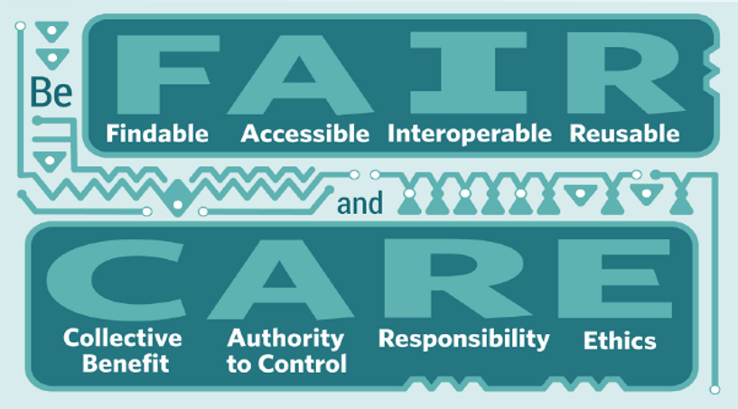
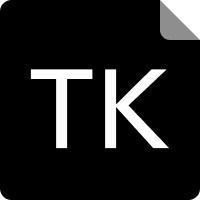
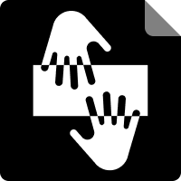
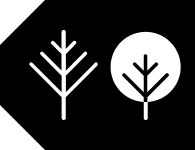

## Historical Context and Colonial Extraction

- **The Extraction Paradigm:** Traditional knowledge and genetic resources harvested historically without consent.[^msulibrary] [^paubox]
- **Deficit-Based Portrayals:** Focus on "5D data" — differences, disparities, disadvantages, dysfunction, deprivation.[^csps-ids]
- **Systemic Consequences:** Colonial statistical framing used to justify state intervention and paternalistic policies.[^csps-ids]

::: {.notes}
We begin today by confronting an uncomfortable truth: data has never been neutral. For Indigenous communities across this continent and around the world, data has been a tool of control. Settler-colonial governments and research institutions built entire bureaucracies to gather information about Native peoples — not to serve those communities, but to manage, surveil, and ultimately dispossess them.

This is what we call the extraction paradigm. Traditional knowledge, genetic resources, ecological data — all harvested without consent, without reciprocity, and without accountability to the people it came from.

What was gathered was then filtered through what scholars call "5D data" — a relentless focus on differences, disparities, disadvantages, dysfunction, and deprivation. Every data point framed as a deficit, every metric a measure of how far Native communities fell short of a white settler norm. And that framing was not accidental. It was used to justify paternalistic state interventions — to say, in effect, "you cannot govern yourselves, so we will govern you."

This is the foundation we are building on — and the foundation we are working to dismantle.
:::

## Defining Indigenous Data Sovereignty

- **Inherent Authority:** Derived from the inherent right of tribes to govern their peoples, lands, and resources — predating any external legal grant.[^paubox] [^nni] [^ca-resources]
- **Comprehensive Scope:** Governs the full data lifecycle — collection, ownership, application, analysis, and distribution.[^msulibrary] [^csps-ids]
- **Rights Holders:** Native Nations are not passive research subjects or consultees — they are rights holders with ultimate authority over their data.[^csps-ids] [^facets]

::: {.notes}
Indigenous Data Sovereignty — or IDSov — is the inherent right of Indigenous Peoples to govern the collection, ownership, and application of data about their communities, lands, and knowledge systems.

I want to emphasize the word *inherent*. This is not a right granted by federal law or bestowed by a government agency. It predates those institutions. It flows from the same sovereign authority that gives tribal nations the right to govern their lands, their people, and their futures.

The scope is comprehensive. We are talking about every stage of the data lifecycle — how data is created, how it is collected, who can access it, how it can be analyzed, and what it can be used for. No single phase is exempt.

And critically, Indigenous nations are not stakeholders in this conversation. They are not consultees who get to weigh in before a researcher makes a final decision. They are rights holders — with ultimate authority over how they are represented in data systems.
:::

## The First Nations Principles of OCAP®

::: {.columns}

::: {.column width="50%"}
- **Ownership:** The collective relationship of a Nation to its cultural knowledge and datasets.[^ocap-brochure] [^ocap-training]
- **Control:** Governing all aspects of the research, analysis, and management lifecycle.[^ocap-brochure] [^ocap-training]
:::

::: {.column width="50%"}
- **Access:** The right of Nations to access their own data, regardless of physical storage location.[^ocap-brochure] [^ocap-training]
- **Possession:** Physical stewardship and custody of data as the operational safeguard of ownership.[^ocap-brochure] [^ocap-training]
:::

:::

::: {.notes}
In Canada, the ethical standard for research involving First Nations data is known as the OCAP® principles — Ownership, Control, Access, and Possession. Developed in 1998 by the Assembly of First Nations, OCAP has become the de facto framework for any institution seeking to work ethically with First Nations communities.

Ownership means the collective, cultural relationship a Nation has with its data. It is not individual — it is communal.

Control means that First Nations have authority over all phases of the research process — design, implementation, analysis, and publication. Not just a seat at the table, but actual decision-making power.

Access means that Nations retain the right to retrieve and manage their data at any time, no matter where it is physically stored. If a government agency or university has been holding your data for decades, you still have the right to get it back.

And Possession is the mechanism that makes all of this real. Physical custody — having your data on infrastructure you control — is what operationalizes ownership. Without possession, sovereignty is only theoretical.
:::

## Human Rights and International Frameworks

- **UNDRIP Alignment:** Rooted in the United Nations Declaration on the Rights of Indigenous Peoples, affirming rights to self-governance and cultural heritage.[^msulibrary] [^nni]
- **Free, Prior, and Informed Consent:** Active, documented community consent is required at every stage of the data lifecycle — not a courtesy, a right.[^ocap-brochure] [^gala-care] [^rda-care]
- **Transnational Alliances:** Indigenous data networks coordinate globally to safeguard rights and prevent knowledge exploitation.[^paubox] [^nnlm] [^tmr-networks]

::: {.notes}
The legal and moral foundation for Indigenous Data Sovereignty extends to the international stage through the United Nations Declaration on the Rights of Indigenous Peoples — UNDRIP. Adopted in 2007, UNDRIP affirms the rights of Indigenous Peoples to self-governance and control over their cultural heritage, including data.

Central to this framework is the principle of Free, Prior, and Informed Consent — FPIC. This is not a checkbox or a courtesy. It means that at every stage of the data lifecycle, communities must have the opportunity to say yes or no with full knowledge of what they are agreeing to. No researcher should be collecting, analyzing, or publishing Indigenous data without this explicit, documented consent.

What is powerful about this moment is that Indigenous data advocates are not fighting these battles in isolation. There are transnational networks — the Global Indigenous Data Alliance, Te Mana Raraunga in Aotearoa New Zealand, Maiam nayri Wingara in Australia — all working in coordination to build a global architecture of data rights. This is an international movement.
:::

## The CARE Principles for Data Governance

- **Collective Benefit:** Data ecosystems must be designed so communities derive direct, tangible value — not just researchers or institutions.[^gala-care] [^rda-care] [^oxford-care]
- **Authority to Control:** Inherent rights to self-determination must be recognized and empowered in data governance structures.[^csps-fair-care] [^rda-care]
- **Responsibility:** Stewardship means fostering relationships built on trust, reciprocity, and investment in community capacity.[^gala-care] [^rda-care]
- **Ethics:** Cultural safety, minimizing harm, and rejecting deficit narratives must be the primary concern at every stage.[^csps-fair-care] [^rda-care]

::: {.notes}
In 2019, the Global Indigenous Data Alliance released the CARE Principles — Collective Benefit, Authority to Control, Responsibility, and Ethics. These principles were designed to address what was missing from existing data governance frameworks: a focus on people, not just data.

Collective Benefit asks a fundamental question: who actually benefits from this data? Too often the answer has been researchers, governments, and corporations — not the communities whose lives the data describes. CARE demands that data ecosystems be built to return tangible value to Indigenous communities.

Authority to Control recognizes that Indigenous Peoples have inherent rights to determine how they are represented, and to apply their own protocols to their own data.

Responsibility is relational. It means that researchers and institutions who work with Indigenous data have an obligation to build genuine relationships — not transactional consultations — and to invest in community data capacity.

And Ethics means that at every stage, from collection to publication to archiving, the cultural safety and wellbeing of the community comes first. No deficit narratives. No extractive agendas.
:::

## Technical Synergy: Aligning FAIR and CARE

::: {.columns}

::: {.column width="55%"}
::: {style="font-size: 0.75em"}
- **FAIR (Data-Centric):** Optimizes Findability, Accessibility, Interoperability, and Reusability for machine-sharing.[^csps-fair-care] [^sfu-fair]
- **CARE (People-Centric):** Centers Collective Benefit, Authority, Responsibility, and Ethics.[^gala-care] [^csps-fair-care] [^sfu-fair]
- **The Tension:** FAIR is power-neutral — without CARE, "open data" becomes a vector for extracting sensitive Indigenous knowledge at scale.
- **The Goal:** Being both FAIR *and* CARE ensures open science does not proceed at the expense of Indigenous sovereignty.[^gala-care] [^csps-fair-care]
:::
:::

::: {.column width="45%"}
{width="100%" fig-align="center"}

::: {.smaller}
*Source: SFU Library*[^sfu-fair]
:::
:::

:::

::: {.notes}
You have probably heard of the FAIR principles — Findable, Accessible, Interoperable, Reusable. These are the technical standards that govern most research data management today, and they are genuinely useful for making data shareable and machine-readable.

But FAIR has a blind spot. It is power-neutral. It does not ask who benefits from the data being shared, or whether the people whose knowledge is embedded in a dataset ever gave permission for it to be made accessible. In a FAIR-only world, "open data" can become a mechanism for extracting and redistributing Indigenous knowledge at industrial scale — without consent, without credit, and without benefit to the community.

This is where CARE becomes essential. CARE does not replace FAIR — it completes it. Together, they create a framework where data is both technically optimized for discovery and ethically governed to protect sovereignty.

The goal is for every data steward, every researcher, every institution to ask not just "is this data FAIR?" but "is it CARE?"
:::

## IEEE 2890-2025: A Global Technical Standard

- **First Global Standard:** Approved in 2025 after a five-year process with direct Indigenous community participation.[^nni]
- **Scope:** Specifies how to record the origin, history, and ownership of data derived from Indigenous lands, cultures, and knowledge systems.
- **Mechanism:** Requires documentation of consent, custodianship, and cultural attribution at the point of collection — carried through every subsequent use.
- **Impact:** Transforms ethical demands into enforceable industry specifications, making CARE operationally mandatory.[^nni]

::: {.notes}
One of the most significant recent developments in this field is the approval of IEEE 2890-2025 — the first global technical standard specifically for the provenance of Indigenous Peoples' data.

After five years of development that included direct participation from Indigenous communities, the Institute of Electrical and Electronics Engineers — one of the most authoritative technical standards bodies in the world — formally adopted this specification. That matters because it moves Indigenous data rights out of the realm of advocacy and into the realm of industry obligation.

What IEEE 2890-2025 does, concretely, is specify how organizations must document the origin, history, and ownership of any data derived from Indigenous lands, cultures, or knowledge systems. It requires that consent, custodianship, and cultural attribution be recorded at the point of collection and carried through every subsequent use.

This is the infrastructure that makes CARE enforceable at a technical level. It is one of the most important tools we have for preventing the kind of data laundering that has historically stripped Indigenous content of its origins.
:::

## Lessons from Exploitation: The Havasupai Case

- **Authorized Scope:** Genetic samples provided in the 1990s specifically and only for tribal diabetes research.[^waapihk]
- **Unauthorized Misuse:** University researchers conducted secondary studies on schizophrenia, migration, and inbreeding — without consent or knowledge of the tribe.[^waapihk]
- **The Settlement:** The Havasupai Tribe sued and reached a $700,000 settlement in 2010, with samples returned — but the damage to trust was irreparable.[^waapihk]
- **The Lesson:** Without physical data possession and explicit written controls, sovereignty is unenforceable.

::: {.notes}
Let me tell you about the Havasupai Tribe of Arizona, because their story is one every researcher and institution needs to hear.

In the early 1990s, Havasupai tribal members provided blood samples to Arizona State University for diabetes research — a disease devastating their community. They gave these samples in good faith, for a specific, community-identified purpose.

What happened next was a profound betrayal. University researchers used those same samples to conduct studies on schizophrenia, inbreeding, and the population's geographic origins — topics the tribe found deeply offensive and that directly contradicted their oral histories and cultural beliefs. None of this was consented to.

The tribe found out, sued, and eventually received a $700,000 settlement and the return of the blood samples in 2010. But you cannot settle away the damage to trust. The Havasupai case became a turning point in research ethics — a concrete demonstration of what happens when a community has no physical possession of their data and no enforceable controls over its secondary use.

This is why OCAP's principle of Possession is not abstract. Physical control is the mechanism that makes all other rights real.
:::

## Weapons of Extraction: Pacific Salmon Case Study

- **Traditional Stewardship:** First Nations communities had centuries of systematic data on salmon return patterns to manage sustainable harvests.[^facets]
- **Colonial Appropriation:** Crown agencies extracted this Indigenous ecological knowledge to expand commercial fisheries.[^facets]
- **The Weaponization:** That same data was then used to ban the traditional fish traps that First Nations had always used — while promoting industrial fishing gear that degraded the ecosystem.[^facets]

::: {.notes}
The Pacific salmon story from British Columbia shows us something even more insidious — data being not just stolen, but weaponized against the very people it came from.

For generations, First Nations communities on the Pacific Coast had carefully observed and recorded salmon migration patterns. This was not casual knowledge — it was sophisticated, systematic data that enabled sustainable fisheries management over centuries.

When Crown agencies gained access to this knowledge, they used it to expand commercial fishing operations. And then, in a stunning act of colonial logic, they turned around and used that same data as evidence to ban the traditional fish traps that First Nations had always used — claiming the traps were unsustainable — while actively promoting the industrial fishing gear that was actually destroying the ecosystem.

The community's own knowledge became the instrument of their dispossession. Their data was extracted, repackaged, and deployed as a legal justification for eliminating their traditional practices and their livelihoods.

This is what "data as a weapon of extraction" means in practice.
:::

## Local Contexts: TK and Biocultural Labels

::: {.columns}

::: {.column width="55%"}
::: {style="font-size: 0.75em"}
- **Western IP Failure:** Copyright protects individual, economic, time-limited rights — structurally unable to protect communal, spiritual, and permanent Indigenous knowledge.[^sfu-copyright]
- **Notices** *(applied by institutions):* Flag Indigenous interests in collections.[^datacite] [^localcontexts]
- **Labels** *(applied only by communities):* Embed community-defined provenance, protocols, and permissions directly into digital metadata.[^localcontexts] [^lc-labels]
:::
:::

::: {.column width="45%"}
::: {.smaller}
**Notices** (applied by institutions)
:::

{width="25%"} {width="25%"} {width="25%"}

::: {.smaller}
**TK Labels** (applied by communities)
:::

{width="25%"} {width="25%"} {width="25%"}
:::

:::

::: {.notes}
Here is the structural problem with existing intellectual property law as it applies to Indigenous knowledge: copyright was designed to protect an individual creator's economic interest for a limited time. Traditional knowledge is the opposite — it is communal, it is spiritual, it is permanent, and it belongs to no single person.

Western IP law simply cannot hold it.

The Local Contexts initiative has developed a practical solution: digital labels and notices that travel with data and communicate Indigenous rights and protocols in terms that modern data systems can read.

There are two categories, and the distinction matters. Notices are applied by researchers and institutions to flag that a collection contains Indigenous interests that need to be addressed. They signal incompleteness — a way of saying, "this collection has Indigenous content and the rights are not yet settled."

Labels are different. Labels are applied only by Indigenous communities themselves. They embed specific cultural protocols directly into digital metadata — who can see this content, under what conditions, for what purposes. A label might indicate that certain material is seasonal, or ceremonial, or restricted to specific community members. These are not suggestions. They are expressions of sovereign authority embedded in the data itself.
:::

## Tribal Institutional Review Boards and Data Use Agreements

- **Beyond Belmont:** The Western Belmont Report and Common Rule focus on individual harm — inadequate for collective, community-level data harms in a Big Data landscape.[^nni]
- **Tribal Data Governance Boards:** The Saginaw Chippewa Indian Tribe established a formal Data Governance Board and research ordinance grounded in Anishinaabe values.[^nni]
- **Data Use Agreements:** The Missouri Breaks Research Institute and Cheyenne River Sioux Tribe used a formal DUA ensuring data ownership remains with the Nation throughout an NIH ECHO Cohort study.[^nni]
- **NIH NOT-OD-22-214:** Federal policy on AI/AN participant data has catalyzed tribal review infrastructure development — but gaps in enforcement remain.[^nni]

::: {.notes}
Let's talk about governance infrastructure, because policies and principles are only as strong as the institutions that enforce them.

The standard ethical framework for U.S. research is the Belmont Report and its codification in the Common Rule. These were designed to protect individual research participants from harm. But they were not designed for a world of Big Data, and they were certainly not designed with collective, communal harms in mind. When a dataset reveals information that affects an entire nation — not just one person — the Belmont framework has no adequate response.

Tribal nations are building their own review infrastructure to fill this gap. The Saginaw Chippewa Indian Tribe of Michigan created a formal Data Governance Board with a research ordinance that grounds all decisions in Anishinaabe values. This is not a bureaucratic checkbox — it is an expression of sovereignty.

For research that crosses into federal funding streams, Data Use Agreements have become a critical legal tool. The Cheyenne River Sioux Tribal Council used a DUA to ensure that data collected in an NIH ECHO Cohort study remained tribal property — not federal property, not university property — tribal property.

NIH policy NOT-OD-22-214 on the responsible management of American Indian and Alaska Native participant data has been a catalyst for this work, but the real driving force is tribal nations demanding the governance infrastructure their sovereignty requires.
:::

## Domain: Environmental and Geospatial Sovereignty

- **Hydrological Sovereignty:** The Diné Household Water Survey uses community-engaged mapping with Chapter-level approvals under strict Navajo Nation data protocols.[^nni]
- **Wildlife Mapping:** NAFWS empowers tribes to interpret their own migration data via ArcGIS and Story Maps — cultural values guide conservation decisions.[^nni]
- **LiDAR Vulnerability:** High-resolution spatial datasets can identify ancestral sites, enabling archaeological inquiry that bypasses community oversight.[^nni]
- **Infrastructure Gaps:** Mesonet weather stations frequently lack Indigenous input; state environmental data policy rarely incorporates tribal perspectives.[^nni]

::: {.notes}
Let me walk through some of the specific domains where Indigenous Data Sovereignty is being actively operationalized, starting with environmental and geospatial data.

The Navajo Nation's Diné Household Water Survey is a powerful example. Water insecurity is a crisis in Diné Bikéyah, and the Nation is addressing it on their own terms — using community-engaged mapping with approval required at the Chapter level, which is the local governmental unit of the Navajo Nation. This is not data collected *about* the Navajo people. It is data collected *by and for* the Navajo people.

The Native American Fish and Wildlife Society is doing similar work with wildlife corridors — giving tribes the tools to interpret their own ecological data and use cultural frameworks, not purely Western scientific ones, to guide conservation.

But I also want to flag a serious technical vulnerability: LiDAR. High-resolution aerial mapping is now sophisticated enough to identify ancestral sites, burial grounds, and archaeological features. If that data is held by external agencies, it can be used to launch inquiries that completely bypass community consent. This is a direct threat to cultural sovereignty that requires immediate policy attention.
:::

## Domain: Genomic and Biocultural Data

- **SING Initiative:** The Summer Internship for Indigenous Peoples in Genomics trains Indigenous scholars in DNA extraction and bioinformatics — ensuring community frameworks guide the science.[^nni]
- **Wise Ancestors Model:** Integrates genome sequencing with community-defined priorities; documented consent is a non-negotiable prerequisite before any biological sampling.[^nni]
- **NAGPRA and Repatriation:** ASU Biocollections uses the IDGov Bundle to facilitate repatriation and govern data classified as "cultural patrimony" under tribal law.[^nni]

::: {.notes}
Genomic data represents perhaps the highest-stakes domain in Indigenous Data Sovereignty, because the consequences of misuse are literally written into the bodies of future generations.

The Summer Internship for Indigenous Peoples in Genomics — SING — is building the pipeline of Indigenous scientists who can engage with genomics on their own terms. When Pacific Islander scholars are trained in DNA extraction and bioinformatics, the cultural frameworks guiding the research are Pacific frameworks. The research questions are community-defined. The interpretation of results is culturally grounded.

The Wise Ancestors model takes this further, formally integrating community-defined priorities into genome sequencing projects and making documented consent a non-negotiable prerequisite. No consent, no sampling. Full stop.

And for institutions holding collections that may contain Indigenous biological materials or associated data, NAGPRA — the Native American Graves Protection and Repatriation Act — creates legal obligations. Tools like the IDGov Bundle are helping institutions like ASU's Biocollections navigate repatriation processes and govern what constitutes cultural patrimony under tribal law.
:::

## Domain: Health and Social Data Sovereignty

- **Sovereign Databases:** The Northern Cheyenne COVID Project built a tribally managed database linking fragmented administrative datasets across state and federal levels, backed by a new tribal Data Sovereignty Law.[^nni]
- **Public Health Authority:** The Alaska Native Epidemiology Center advocates for formal recognition of Tribal public health authority within statewide surveillance systems.[^nni]
- **Urban Governance:** The Montana Consortium for Urban Indian Health established a Data Governance Committee to manage clinical data for Urban Indian Organizations — because sovereignty follows people, not reservation boundaries.[^nni]

::: {.notes}
The COVID-19 pandemic exposed, with brutal clarity, the consequences of tribes not controlling their own health data. Federal and state systems were collecting data about Native communities — inconsistently, often inaccurately, and without tribal input — at the exact moment when accurate data was a matter of life and death.

The Northern Cheyenne Nation responded by building their own. They developed a tribally managed database that links fragmented administrative data across state and federal systems, and they backed it with a tribal Data Sovereignty Law. The Nation now has sovereign authority over health data about their own community. That is what self-determination looks like in a public health crisis.

The Alaska Native Epidemiology Center is fighting a different battle — for formal recognition within statewide surveillance systems. Tribal public health authority exists, but it is not always acknowledged by state systems built without tribes in mind.

And for urban Native communities — who are often invisible in both tribal and municipal data systems — the Montana Consortium for Urban Indian Health created a Data Governance Committee specifically to manage clinical data for Urban Indian Organizations. Because sovereignty follows the people, not just the reservation boundary.
:::

## Domain: Education and Economic Sovereignty

- **Decolonizing Metrics:** The TCU Institutional Research Collaborative is replacing deficit-based enrollment indicators with "Cultural Key Enrollment Indicators" defined by communities themselves.[^nni]
- **Access Controls:** The American Indian College Fund uses Zengine workspaces to restrict TCU scholarship and enrollment data access to each respective institution only.[^nni]
- **Native Economic Trends:** The Center for Indian Country Development tracks 70+ economic indicators for Indian Country while formally protecting tribal data residency and community control.[^nni]

::: {.notes}
Education and economic data are areas where deficit framing has been most entrenched and most damaging. Tribal college enrollment data has historically been reported through metrics designed by and for Western institutions — metrics that treat Native student attrition as failure without accounting for community obligations, economic pressures, and cultural disruptions that shape those numbers.

The Tribal College and University Institutional Research Collaborative is building alternatives. They are developing Cultural Key Enrollment Indicators — metrics that reflect what communities actually value and center success on community-defined terms, not colonial benchmarks.

At the operational level, the American Indian College Fund is using Zengine — a custom grants management platform — to ensure that scholarship and enrollment data collected for one TCU cannot be accessed by another. Data access is controlled at the institutional level, by the communities themselves.

And the Center for Indian Country Development at the Federal Reserve Bank of Minneapolis — the Native Economic Trends project — is tracking over 70 economic indicators for Indian Country while building in formal protections for tribal data residency. Economic data about tribal nations should be governed by tribal nations.
:::

## Sovereign Digital Infrastructure

::: {.columns}

::: {.column width="50%"}
**Hardware Layer**

- **Makwa7:** Sovereign data centers built on Indigenous land — physical jurisdiction over community data.[^nni]

**Software Layer**

- **Mukurtu:** Indigenous CMS for culturally sensitive archiving.[^nni]
- **Guardian Connector:** Open-source environmental monitoring co-created with Fort McKay Métis Nation.[^nni]
:::

::: {.column width="50%"}
**Technical Innovations**

- **Secure Relational Jumps (SRJ):** A sovereign file format that embeds consent and provenance metadata directly into the file container.[^nni]
- **Pewa Data Trust:** Blockchain-based architecture for community-governed data management and AI content validation.[^nni]

**The Principle:** Move away from commercial cloud toward community-controlled infrastructure.
:::

:::

::: {.notes}
Sovereignty without infrastructure is aspiration without teeth. If Indigenous data lives on Amazon Web Services or Google Cloud, it is subject — at some fundamental level — to the terms and surveillance capabilities of those corporations, regardless of what tribal policy says.

The 2026 Summit made this a central theme: tribes need to own the stack.

At the hardware level, Makwa7 is a model for sovereign data centers — physical facilities built on Indigenous land, under community jurisdiction. The data does not just belong to the tribe in principle; it literally sits on tribal land.

At the software level, tools like Mukurtu — a content management system designed specifically for culturally sensitive Indigenous archiving — give communities tools that were built for their needs, not retrofitted from corporate platforms. Guardian Connector, developed with the Fort McKay Métis Nation, allows communities to run their own environmental monitoring systems with full control over the data.

And at the innovation frontier, Secure Relational Jumps embed consent and provenance metadata directly into file containers — so the data carries its own governance instructions wherever it travels. The Pewa Data Trust uses blockchain to create a community-governed architecture that can even validate AI-generated content for cultural accuracy.

This is the sovereign tech stack. It is not hypothetical. It is being built now.
:::

## Artificial Intelligence and Digital Colonialism

- **"Data Res Nullius":** AI development treats Indigenous digital content as *Terra Nullius 2.0* — empty data ripe for extraction without consent or attribution.[^nni]
- **Algorithmic Coloniality:** AI training datasets scrape Indigenous languages, art, and traditional knowledge, facilitating dispossession at industrial scale.[^nni]
- **Surveillance:** AI tools are being deployed to track and harass Indigenous rights defenders protecting ancestral territories.[^nni]
- **Biocolonialism:** Genetically engineered microbes deployed in agricultural soil without tribal consent have shown persistence beyond engineered containment, affecting land biodiversity.[^nni]

::: {.notes}
We are living through a second colonial land rush — and this time the land is digital.

The legal doctrine that empowered European colonizers to seize Indigenous territories was called Terra Nullius — empty land, belonging to no one. Some legal scholars are now calling the AI industry's approach to Indigenous digital content "Data Res Nullius" — data belonging to no one, free for anyone to take.

AI training datasets have scraped Indigenous languages, ceremonial art, traditional ecological knowledge, and oral histories — all without consent, without attribution, and without any benefit flowing back to the communities this knowledge belongs to. The content goes in, the model learns from it, and the community receives nothing. In some cases, the model then generates content that misrepresents or decontextualizes that knowledge at scale.

We are also seeing AI-enabled surveillance being deployed against Indigenous rights defenders — people protecting ancestral territories from extractive industries. This is a direct weaponization of data technology against sovereignty.

And in synthetic biology, genetically engineered microbes introduced into agricultural soil have persisted beyond their designed containment parameters — affecting biodiversity on Indigenous lands without any tribal consent or governance involvement.

These are not hypothetical future risks. They are happening now.
:::

## Responding to the AI Threat: Proactive Governance

- **The KIA'I Framework:** Hawaiian-led, community-driven AI governance using the Pewa Data Trust and blockchain to validate AI-generated content against community-defined standards for cultural accuracy.[^nni]
- **IEEE 2890-2025 Implementation:** Re-inscribing attribution and provenance into data metadata at every lifecycle stage prevents "data laundering" of Indigenous content.[^nni]
- **Indigenous Biotech Protocols:** Community deliberation must be a formal prerequisite in biotechnology design — before deployment, not after.[^nni]
- **Policy Advocacy:** USIDSN and NNI are advancing requirements for Indigenous consultation before AI training datasets are assembled from public archives.[^nni]

::: {.notes}
But Indigenous communities are not waiting to be protected — they are building their own governance systems for the AI era.

The KIA'I Framework, developed by Hawaiian practitioners, creates a community-driven AI governance model. Using the Pewa Data Trust and blockchain technology, it validates AI-generated content against community-defined standards for cultural accuracy. If an AI system generates something claiming to represent Hawaiian culture, the KIA'I framework provides a mechanism for the community to audit that claim and correct the record.

Full implementation of IEEE 2890-2025 is another critical tool — because if provenance is embedded in data at the point of collection and carried through every subsequent use, the kind of data laundering that erases Indigenous origins from training datasets becomes technically traceable and legally actionable.

For synthetic biology, Indigenous leaders are demanding that community deliberation be a formal prerequisite in the design phase — before anything is deployed — not an afterthought after an engineered organism has already been released into the environment.

And at the policy level, the U.S. Indigenous Data Sovereignty Network and the Native Nations Institute are pushing for federal requirements that mandate Indigenous consultation before AI training datasets are assembled from public archives containing Indigenous content.

The governance is being built. The question is whether institutions will adopt it before more harm is done.
:::

## Operationalizing Sovereignty: Cherokee Nation Model

- **Executive Order 2024-07-CTH:** Established the Cherokee Nation Task Force on Data Sovereignty and Governance — formal, executive-level commitment.[^ca-resources]
- **Cherokee AI Policy (2025):** Formed a Generative AI Governance Committee to protect PII, PHI, and Cherokee cultural assets from unauthorized AI training.[^ca-resources]
- **Core Rule:** No confidential or sensitive tribal data may be entered into public LLMs or AI tools.[^ca-resources]
- **Procurement Standards:** All technology vendors must demonstrate compliance with tribal data governance requirements before doing business with the Nation.

::: {.notes}
The Cherokee Nation has built one of the most comprehensive and forward-looking tribal data governance frameworks in the country, and it is worth studying in detail.

In 2024, Principal Chief Hoskin signed Executive Order 2024-07-CTH, establishing a Task Force on Data Sovereignty and Governance. This is formal, executive-level commitment — not a committee recommendation, not a strategic plan collecting dust on a shelf. An executive order.

The following year, the Nation formalized a Generative AI Governance Policy, creating a committee specifically charged with protecting personally identifiable information, protected health information, and Cherokee cultural assets from unauthorized AI training. The core rule is clear: no confidential or sensitive tribal data goes into public LLMs. Period.

And critically, this extends to procurement. Every technology vendor seeking to do business with the Cherokee Nation must demonstrate compliance with tribal data governance requirements. Sovereignty extends to the contract.

This is what institutional operationalization of data sovereignty looks like: executive authority, formal governance bodies, explicit rules, and enforceable standards.
:::

## Cherokee Values as Policy Pillars

- ***detsadasinasdi itsehesdi:*** "Live and be highly skilled" — utilize technology resourcefully to augment human talents.[^ca-resources]
- ***detsadageyusesdi:*** "Be protective of one another's existence" — data protection as a core expression of self-governance.[^ca-resources]
- ***nudantiyu detsadanvwidisgesdi:*** "Encourage and instruct one another" — collaborative, community-grounded governance.[^ca-resources]

::: {.notes}
What makes the Cherokee Nation's approach distinctive is not just the policy — it is the foundation the policy rests on.

These data governance frameworks are not translations of federal regulations into tribal language. They are expressions of Cherokee values in a digital context. The Nation identified three core principles from Cherokee tradition and used them as the explicit philosophical pillars of their data policy.

Detsadasinasdi itsehesdi — live and be highly skilled — grounds the embrace of technology. The Cherokee Nation is not anti-technology. They are pro-sovereignty. Using tools skillfully in service of the community is a Cherokee value.

Detsadageyusesdi — be protective of one another — is the moral foundation for data protection. Protecting community data is the same act as protecting community members. They are inseparable.

And nudantiyu detsadanvwidisgesdi — encourage and instruct one another — establishes that governance must be collaborative, built through community deliberation, not imposed from outside.

I want you to hold onto this: the most sophisticated tribal data governance framework in the country is grounded not in federal law or technical standards, but in Cherokee values that are centuries old. That is what Indigenous Data Sovereignty means in practice.
:::

## Legal Infrastructure: Yurok and Karuk Models

- **Yurok Sovereign Data Agreement (2026):** Legally binds researchers to strict limits on data creation, exchange, and secondary use — violations carry legal consequences.[^ca-resources]
- **Karuk Tribe's Practicing Pikyav:** Research policies rooted in Karuk relational ethics demanding collaborative governance as a binding requirement, not an aspiration.[^ca-resources]
- **The "Four Buckets" Framework:** Tribal codes, contracts, easements, and compliance form a complete legal architecture for protecting digital sovereignty.[^ca-resources]

::: {.notes}
Moving from policy to law, the Yurok and Karuk Nations in Northern California provide models for how tribes can build legally enforceable data protection.

The Yurok Tribe's Sovereign Data Sharing and Security Agreement, finalized in 2026, is a contract that anyone seeking to work with Yurok data must sign. It is not a memorandum of understanding. It is not a request for courtesy. It is a legally binding agreement that specifies exactly what data can be created, who can access it, how it can be used, and what happens to it at the end of the research relationship. Violations have legal consequences.

The Karuk Tribe takes a different but complementary approach through what they call Practicing Pikyav — a concept rooted in Karuk relational ethics meaning healing the land through right relationship. Their research governance framework embeds these relational obligations directly into research agreements, demanding collaborative governance as a binding requirement rather than an aspiration.

Together, these examples illustrate what scholars call the "four buckets" of tribal legal infrastructure for data governance: formal tribal codes that establish jurisdiction, contracts and data use agreements that bind external parties, easements and access restrictions on physical and digital territories, and compliance frameworks that align with federal and state law while preserving tribal authority.

If you are advising a tribal nation on data governance, these four buckets are where the work begins.
:::

## The Māori Data Sovereignty Model

- **Te Mana Raraunga:** Māori data as *taonga* (treasure) — to be governed with the same care as any precious cultural inheritance.[^tmr-networks]
- **Māori Data Audit Tool:** Enables organizations to assess their institutional readiness to implement Indigenous data principles.[^tmr-tools]
- **Aotearoa as a Model:** One of the most advanced national-level Indigenous data frameworks in the world — IDSov principles integrated directly into government data policy.[^tmr-networks]

::: {.notes}
Before we close, I want to spend a moment on a model from the other side of the world that has a great deal to teach us: the Māori Data Sovereignty framework in Aotearoa New Zealand.

The guiding network is Te Mana Raraunga — the Māori Data Sovereignty Network. Their foundational premise is that Māori data is taonga — a treasure, held in trust for present and future generations, to be governed with the same reverence as any precious cultural inheritance. This is not a bureaucratic framing. It is a relational and spiritual one.

What is particularly remarkable about the Aotearoa context is the degree to which Māori data sovereignty principles have been integrated into national government data policy. This did not happen overnight, and it did not happen without sustained political advocacy. But it demonstrates that national-level structural change is achievable.

The Māori Data Audit Tool gives organizations — government agencies, universities, research institutions — a practical mechanism to assess their own readiness to implement Indigenous data principles. It is a mirror: look at your systems, your policies, your practices, and honestly evaluate whether they respect Māori data rights.

This is the kind of institutional self-assessment every organization working with Indigenous communities should undertake.
:::

## Global Networks and Actionable Steps

::: {.columns}

::: {.column width="50%"}
**The Global Ecosystem**

- GIDA — Global Indigenous Data Alliance[^gida]
- USIDSN — U.S. Indigenous Data Sovereignty Network
- NNI — Native Nations Institute[^nni]
- Te Mana Raraunga (Aotearoa/NZ)[^tmr-networks]
- Maiam nayri Wingara (Australia)[^mnw]
:::

::: {.column width="50%"}
**Strategic Actions for Tribal Leadership**

1. Establish tribal IRBs and research ordinances
2. Draft and enforce Sovereign Data Sharing Agreements
3. Build local digital infrastructure and broadband
4. Invest in community data literacy and workforce
5. Adopt Local Contexts labels and IEEE 2890-2025
6. Engage the global IDSov network
:::

:::

::: {.notes}
We have covered a great deal of ground today — from the history of colonial extraction to the technical architecture of sovereign data systems, from international law to Cherokee values, from the Havasupai case to the AI frontier.

I want to close by emphasizing that tribal nations engaged in this work are not alone. There is a global network — GIDA, USIDSN, the Native Nations Institute, Te Mana Raraunga in New Zealand, Maiam nayri Wingara in Australia — working in coordination to build the legal, technical, and political infrastructure for Indigenous data rights. Every step taken by a tribal nation strengthens the entire network.

For tribal leadership, six concrete action steps. First: establish your own institutional review infrastructure — tribal IRBs and research ordinances that put governance in community hands. Second: draft and enforce Sovereign Data Sharing Agreements with every external partner. If they will not sign, they do not get access. Third: invest in physical digital infrastructure — your data belongs on your land. Fourth: build the capacity of your community to work with data — data literacy and a trained Indigenous data workforce are themselves acts of sovereignty. Fifth: engage with tools like the Local Contexts Hub and align your practices with IEEE 2890-2025 to embed your rights in technical systems. And sixth: plug into the global network. Your allies are organizing.

Data sovereignty is not a destination. It is a practice of self-determination, carried out every day, in every data decision. Thank you.
:::

## References {.smaller}

[^msulibrary]: Indigenous Data Sovereignty — MSU Library | Montana State University. <https://www.lib.montana.edu/services/data/ids/>

[^csps-ids]: Indigenous Data Sovereignty (DDN3-A11) — CSPS. <https://www.csps-efpc.gc.ca/tools/articles/indigenous-data-sovereignty-eng.aspx>

[^paubox]: Data sovereignty for tribal nations — Paubox. <https://www.paubox.com/blog/data-sovereignty-for-tribal-nations>

[^nni]: Indigenous Data Sovereignty and Governance | Native Nations Institute. <https://nni.arizona.edu/our-work/research-policy-analysis/indigenous-data-sovereignty-governance>

[^ca-resources]: Indigenous Data Sovereignty for Tribal Stewardship — CA Natural Resources Agency. <https://resources.ca.gov/Initiatives/Tribalaffairs/TribalStewardshipPolicyAndToolkit/Explore-the-Toolkit/Indigenous-Data-Sovereignty-for-Tribal-Stewardship>

[^gida]: Who We Are — Global Indigenous Data Alliance. <https://www.gida-global.org/whoweare>

[^facets]: Taking care of knowledge, taking care of salmon: towards Indigenous data sovereignty in an era of climate change and cumulative effects — *Facets Journal*. <https://www.facetsjournal.com/doi/10.1139/facets-2023-0135>

[^nnlm]: Data Sovereignty — NNLM. <https://www.nnlm.gov/resources/data/data-glossary/data-sovereignty>

[^ocap-brochure]: The First Nations Principles of OCAP® — FNIGC. <https://fnigc.ca/wp-content/uploads/2022/10/OCAP_Brochure_20220927_web.pdf>

[^ocap-training]: The First Nations Principles of OCAP® — FNIGC Training. <https://fnigc.ca/ocap-training/>

[^waapihk]: The First Nations Principles of OCAP® — Waapihk Research. <https://waapihk.com/2023/02/14/the-first-nations-principles-of-ocap/>

[^gala-care]: Data Management with FAIR and CARE — CARE Principles | Gala. <https://www.learngala.com/cases/data-management/6>

[^csps-fair-care]: Implementing FAIR and CARE Data Principles (DDN3-A12) — CSPS. <https://www.csps-efpc.gc.ca/tools/articles/fair-care-eng.aspx>

[^sfu-fair]: Data with principles: How to be FAIR, and why you should CARE — SFU Library. <https://www.lib.sfu.ca/help/publish/scholarly-publishing/radical-access/fair-and-care-data>

[^rda-care]: CARE Principles for Indigenous Data Governance — Research Data Alliance. <https://www.rd-alliance.org/wp-content/uploads/2024/03/CARE20Principles20for20Indigenous20Data20Governance_OnePagers_FINAL20Sept2006202019.pdf>

[^datacite]: Local Contexts Notices and Labels — DataCite Support. <https://support.datacite.org/docs/local-contexts-notices-and-labels>

[^localcontexts]: Local Contexts — Grounding Indigenous Rights. <https://localcontexts.org/>

[^sfu-copyright]: Beyond copyright: traditional knowledge and biocultural labels — SFU Library. <https://www.lib.sfu.ca/help/publish/scholarly-publishing/radical-access/beyondcopyright-traditionalknowledge-bioculturallabels>

[^lc-labels]: Labels — Local Contexts. <https://localcontexts.org/labels/about-the-labels/>

[^tmr-networks]: Networks and Organisations — Te Mana Raraunga. <https://www.temanararaunga.maori.nz/kaiwhakahau>

[^mnw]: Maiam nayri Wingara Indigenous Data Sovereignty Collective. <https://www.maiamnayriwingara.org/>

[^tmr-tools]: Māori & Indigenous Data Sovereignty Tools — Te Mana Raraunga. <https://www.temanararaunga.maori.nz/resource-hub-copy>

[^oxford-care]: CARE Principles — Research Data Oxford. <https://researchdata.ox.ac.uk/care-principles>